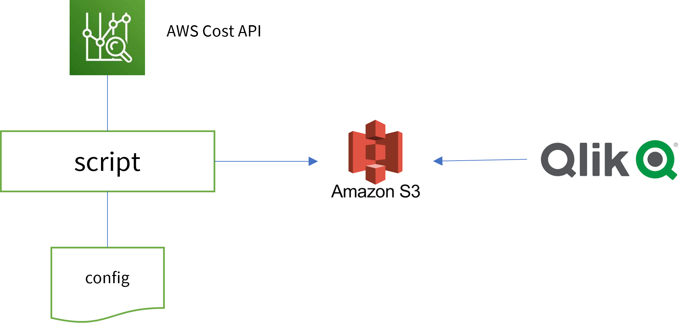
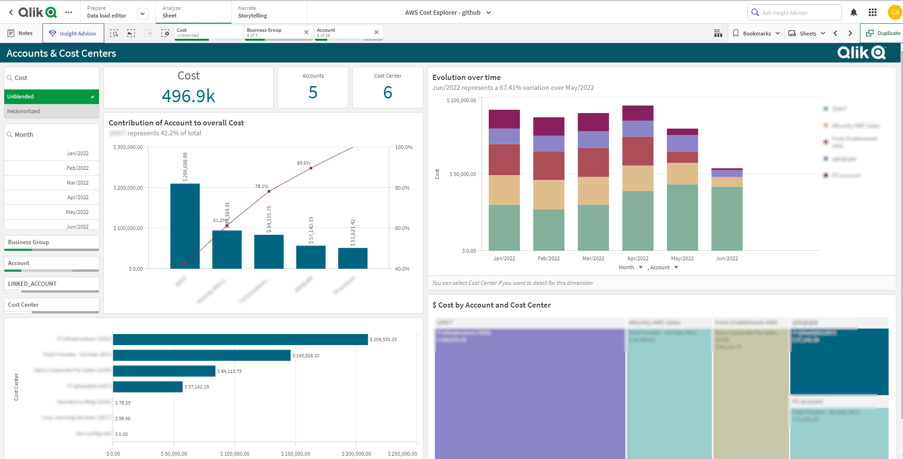
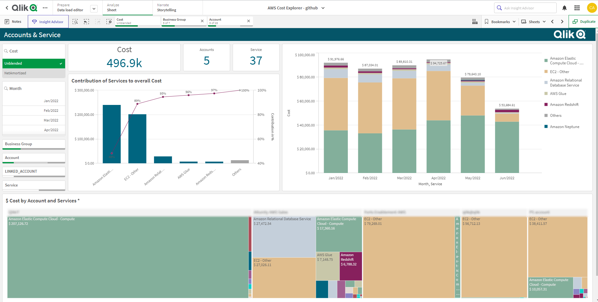

# Qlik AWS Cost Explorer Report Generator

## License Summary

This project is made available under a modified MIT license. See the [LICENSE](LICENSE) file.

## Disclaimer

1. This is **not** a Qlik Supported Project/Product.
2. Contributions such as Issues, Pull Request and additional codes are welcomed.
3. **Qlik Inc.** or **Qlik Support** has no affiliation with this project. The initial version was developed by [Clever Anjos](https://www.linkedin.com/in/cleveranjos/) who is currently employed as Principal Solution Architect at Qlik Partner Engineering Team.

## Purpose

The purpose of this script is use the [AWS Cost Explorer API](https://docs.aws.amazon.com/aws-cost-management/latest/APIReference/API_GetCostAndUsage.html) endpoint to retrieve cost data about one (or more) AWS accounts.

Based on a configuration file, this script will generate csv files that can be ingested by BI tools like Qlik Sense. We provide a qvf that is a template for that data consumption.

This project was inspired by this [AWS sample](https://github.com/aws-samples/aws-cost-explorer-report)

## Usage

### Execution Options

There are several options to run this script.

One option is use this script as a standalone program to be executed in one server or machine with access to a S3 bucket.

This script may be deployed as well as a AWS Lambda function. Using this serveless approach is possible because the footprint to execute the script is really tiny (128Mb for small AWS accounts) increasing accordingly to how many records you retrieve from the API. For example, daily detailed extractions consumes more memory than monthly ones.

### Configuration file

After you decide how you are executing this script, you need to configure the file [reports.json](./reports.json). This file contains one array of objects with these parameters:

Most of the parameters relates to [API Parameters](https://docs.aws.amazon.com/aws-cost-management/latest/APIReference/API_GetCostAndUsage.html) please read this documentation carefully before creating your reports.

1. **Report** - This is the report name. You report will be extracted as report.csv
2. **GroupBy** - One or two (the AWS API only allow up to 2 dimensions) dimensions or tags to accumulate your report
3. **Granularity**  - "DAILY"/"MONTHLY"
4. **Split** - "true" (the script will send one request by day) / "false" (the script will send one request for calculated start -- end timeframe)
5. **Metric** -  Check the API documentation for possible metrics to be extracted

### Environment variables

You need to set some environment variables before executing this script:

1. **S3_BUCKET** - S3 bucket name used to store the extracted data in a csv format
2. ***MONTHS** - How many months prior to today to extract
3. **CURRENT_MONTH** - true(only the current month is extracted)/false(*MONTHS* parameter will be used to calculate the dates)

## Qlik Sense Application

We provide one [template](qvf/AWS%20Cost%20Explorer%20-%20github.qvf) to consume the data extracted by the script. You can import it into your Qlik Sense environment and modify to adjust to your needs.
Some screenshots below (intentionally blurred)

## Prerequisites

1. An S3 bucket to store the final csv result. If this is not present, the file will be stored into the TEMP directory
2. An AWS access key pair for [IAM user](<https://docs.aws.amazon.com/IAM/latest/UserGuide/id_credentials_access-keys.html>) with permissiont to connect to Cost Explorer API and the S3 bucket
3. Python 3.10
4. [Pandas 1.4.2](<https://pandas.pydata.org/pandas-docs/stable/>)
5. [Boto 3](<https://boto3.amazonaws.com/v1/documentation/api/latest/index.html>)

## Using Lambda function to execute

One efficient way of executing this script is using AWS Lambda servless archictecture that allows the execution with  a tiny footprint.
Please refer to [this documentation](https://docs.aws.amazon.com/lambda/latest/dg/lambda-python.html) about how to create a lambda function

One important mention is that we are using one layer provided by [this project](https://github.com/aws-samples/aws-cost-explorer-report)

## AWS Costs

There are costs involved in data extraction from Cost Explorer API:

* Cost Explorer API calls
  * [$0.01 per API call (about 25 calls per run)](https://aws.amazon.com/aws-cost-management/pricing/)
* AWS Lambda Invocation (if you choose this option)
  * Usually [Free](https://aws.amazon.com/free/)  
* Amazon S3
  * Minimal usage
